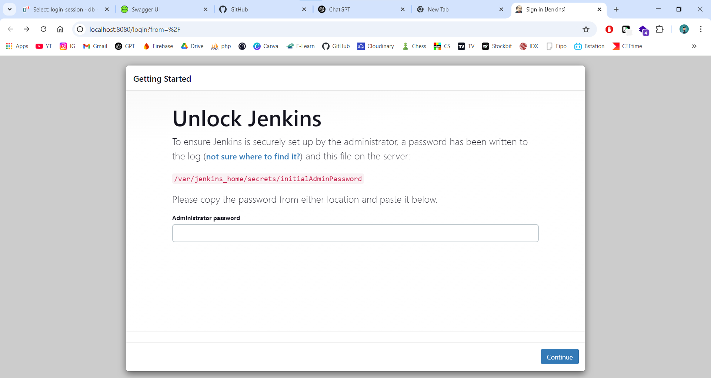
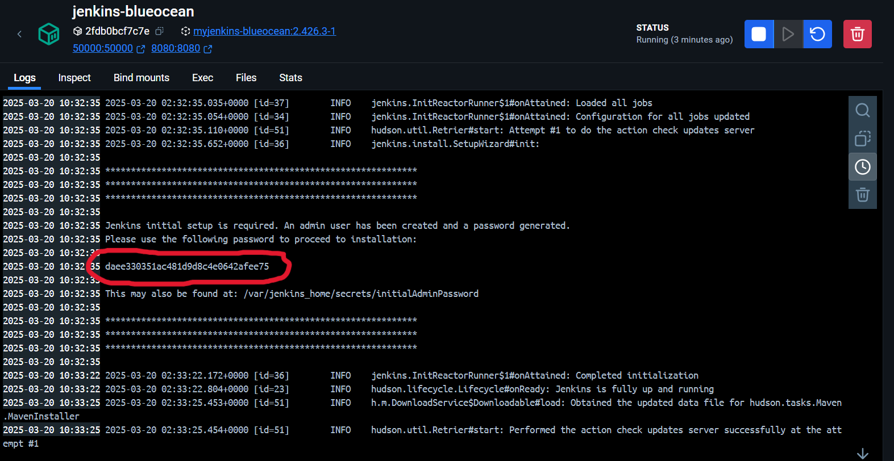
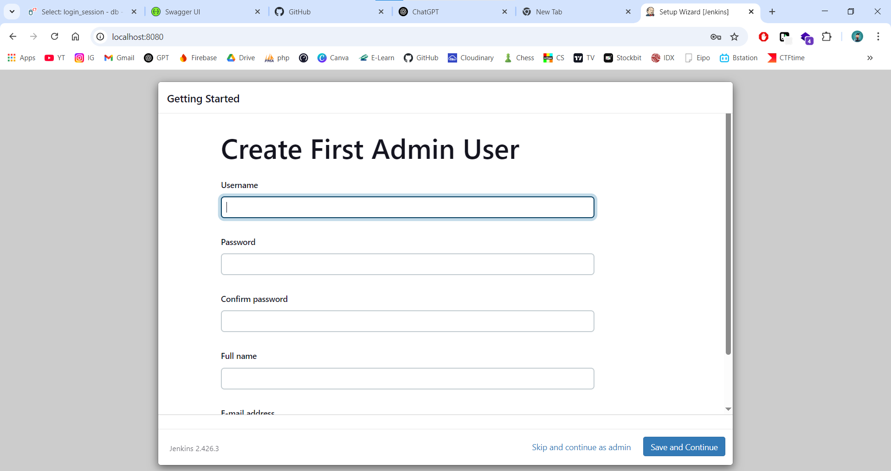

# jenkins-ci-pipeline-exercise
This exercise will teach you how to use Jenkins to orchestrate a React application. The application uses React and Node.js to display a web page with the content "Welcome to React" and includes tests to verify the rendering process of the application.

## Create jenkins service
### 1. Create jenkins docker network
Open terminal and run the following command:
```sh
docker network create jenkins
```

### 2. Create jenkins docker container
Open terminal and run the following command:
```sh
docker run \
  --name jenkins-docker \
  --detach \
  --privileged \
  --network jenkins \
  --network-alias docker \
  --env DOCKER_TLS_CERTDIR=/certs \
  --volume jenkins-docker-certs:/certs/client \
  --volume jenkins-data:/var/jenkins_home \
  --publish 2376:2376 \
  --publish 3000:3000 \
  --restart always \
  docker:dind \
  --storage-driver overlay2
```

### 3. Create jenkins blueocean container
Create Dockerfile in a directory you want, if you dont have create a new one:
```sh
mkdir jenkins-blueocean
```

Then copy this following code into Dockerfile:
```docker
FROM jenkins/jenkins:2.346.1-jdk11

USER root

RUN apt-get update && apt-get install -y lsb-release
RUN curl -fsSlo /usr/share/keyrings/docker-archive-keyring.asc \
https://download.docker.com/linux/debian/gpg

RUN echo "deb [arch=$(dpkg --print-architecture) \
signed-by=/usr/share/keyrings/docker-archive-keyring.asc] \
https://download.docker.com/linux/debian \
$(lsb_release -cs) stable" > /etc/apt/sources.list.d/docker.list

RUN apt-get update && apt-get install -y docker-ce-cli

USER jenkins

RUN jenkins-plugin-cli --plugins "blueocean:1.25.5 docker-workflow:1.28"
```

Build the Dockerfile into docker image:
```sh
docker build -t myjenkins-blueocean:2.346.1-1 .
```

After that, run the container:
```sh
docker run \
  --name jenkins-blueocean \
  --detach \
  --network jenkins \
  --env DOCKER_HOST=tcp://docker:2376 \
  --env DOCKER_CERT_PATH=/certs/client \
  --env DOCKER_TLS_VERIFY=1 \
  --publish 8080:8080 \
  --publish 50000:50000 \
  --volume jenkins-data:/var/jenkins_home \
  --volume jenkins-docker-certs:/certs/client:ro \
  --volume "%USERPROFILE%":/home \
  --restart=on-failure \
  --env JAVA_OPTS="-Dhudson.plugins.git.GitSCM.ALLOW_LOCAL_CHECKOUT=true" \
  myjenkins-blueocean:2.346.1-1
```

## Setup jenkins wizard
### 1. Open jenkins
Open browser and run http://localhost:8080. and you will see the jenkins UI.



we need to input the password. we can see the password by run:
```sh
docker logs jenkins-blueocean
```

or open via docker desktop



then choose **install suggested plugins** and wait until the installation finished.



create admin user and continue.

## Fork and clone react app repository
1. Fork this [React app](https://github.com/dicodingacademy/a428-cicd-labs/tree/react-app) repository into your github account. and uncheck the **copy the main branch only** option.

2. Clone the React app:
```sh
git clone -b react-app https://github.com/YOUR-GITHUB-USERNAME/a428-cicd-labs.git
```

## Create project pipeline in jenkins
1. Open Jenkins at http://localhost:8080.
2. Click **New Item** and name the project, for example, react-app.
3. Select **Pipeline** and click **OK**.
4. In the **Pipeline** section, select **Pipeline script from SCM**.
5. Select **Git** and enter the path to your local repository, for example:
```sh
/home/a428-cicd-labs
```
6. In the **Branch Specifier** field, enter `*/react-app`.
7. Click **Save** to save the project.

## Create Jenkinsfile
1. Open the react app project with visual studio code.
2. Copy this following code into Jenkinsfile:
```
pipeline {
    agent {
        docker {
            image 'node:16-buster-slim'
            args '-p 3000:3000'
        }
    }
    stages {
        stage('Build') {
            steps {
                sh 'npm install'
            }
        }
        stage('Test') {
            steps {
                sh './jenkins/scripts/test.sh'
            }
        }
    }
}
```
3. Commit the Jenkinsfile into local repository
```sh
git add .
git commit -m "Add Jenkinsfile"
```

## Run the pipeline
1. Open Jenkins and click **Open Blue Ocean**.
2. Select the `react-app` project and click **Run**.
3. Jenkins will run the **Build** and **Test** stages. If successful, you will see a green status in the Blue Ocean interface.